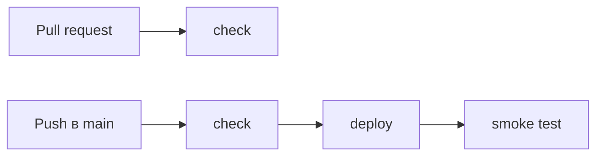
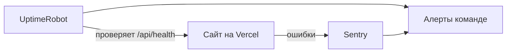

# Каталог репетиторов: CI/CD-демо

Небольшое приложение на Next.js с пайплайном GitHub Actions, который проверяет код
и деплоит его на Vercel.

- Сайт: <https://test-task-nine-mu.vercel.app>
- Health-check: <https://test-task-nine-mu.vercel.app/api/health>
- Пайплайн: [`.github/workflows/ci.yml`](.github/workflows/ci.yml)

## Как устроен пайплайн



**`check`** запускается на каждый PR и на каждый пуш в `main`, кроме изменений только в документации:

1. `npm ci` ставит зависимости строго по `package-lock.json`, поэтому в CI
   те же версии, что и локально.
2. `lint` (ESLint) и `typecheck` (`tsc`) ищут ошибки ещё до запуска кода.
3. `test` (Vitest) проверяет логику фильтрации и health-эндпоинт.
4. `build` проверяет, что проект собирается. Сломанная сборка видна уже в PR.

**`deploy`** запускается только на пуш в `main` и только если `check` прошёл (`needs: check`):

1. `vercel pull` скачивает настройки проекта.
2. `vercel build --prod` собирает проект в раннере GitHub и вшивает в сборку хеш коммита.
3. `vercel deploy --prebuilt --prod` выкладывает готовую сборку на прод.
4. Smoke-тест опрашивает `/api/health` и ждёт, пока там появится хеш именно этого
   коммита. Так проверяется, что на проде новая версия, а не просто «сайт открывается».

Мерж в `main` закрыт branch protection: без зелёного `check` смержить PR нельзя.

## Почему такие инструменты

- **GitHub Actions**: код уже на GitHub, ничего не нужно настраивать отдельно,
  бесплатно для публичных репозиториев.
- **Vercel**: родной хостинг для Next.js, бесплатный тариф, тот же стек, что у команды.
- **Деплой через Vercel CLI, а не через Git-интеграцию Vercel.** Интеграция деплоит каждый
  пуш, не дожидаясь тестов. Поэтому в [`vercel.json`](vercel.json) она отключена,
  и выложить код на прод можно только через пайплайн.
- **Vitest и ESLint**: стандартные инструменты для TypeScript, работают без лишней настройки.

Мелкие решения:

- Версия Node задана один раз в `package.json` (`engines`), её используют и CI, и Vercel.
- Экшены закреплены по SHA коммита, Vercel CLI — по точной версии. Если кто-то
  перевесит тег, в пайплайн не попадёт чужой код с доступом к токену деплоя.
- Токен и ID проекта Vercel лежат в GitHub Secrets, в коде их нет.
- `concurrency`: новый пуш в PR отменяет устаревший прогон, а деплой в `main`
  не прерывается на середине. Если за это время пришли новые пуши, после него
  выкатится самый свежий.
- У токена GitHub в пайплайне только права на чтение, у джобов таймаут 10 минут.
- Пуши в `main`, где менялась только документация (`*.md`), не запускают пайплайн:
  передеплоивать нечего. На PR проверка запускается всегда, иначе обязательный
  `check` не отчитается и PR нельзя будет смержить.

## Мониторинг (подход)

Внедрять не требовалось, поэтому это описание.



- **UptimeRobot** регулярно проверяет `/api/health` и сообщает команде, если сайт недоступен.
- **Sentry** собирает ошибки приложения, которые не видны по одной доступности:
  сайт может отвечать, но ломаться у пользователей.
- Когда появится база, health-check будет проверять и её.

## Что бы добавил при росте

- **Preview-деплои для PR** со ссылкой в комментарии, чтобы смотреть изменения до мержа.
- **Автооткат**: если smoke-тест упал, выполнить `vercel rollback`. Пока откат
  делается вручную одной кнопкой в дашборде Vercel.
- **Dependabot** для обновления экшенов и npm-пакетов. Без него закреплённые SHA не обновляются.
- **Отдельное окружение для staging** со своей базой Supabase, когда preview-деплоев
  станет недостаточно.

## Локальный запуск

```bash
npm ci
npm run dev        # http://localhost:3000
npm run lint && npm run typecheck && npm test
```
